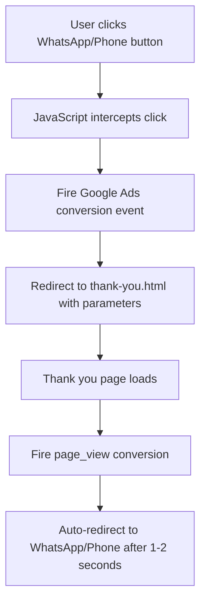
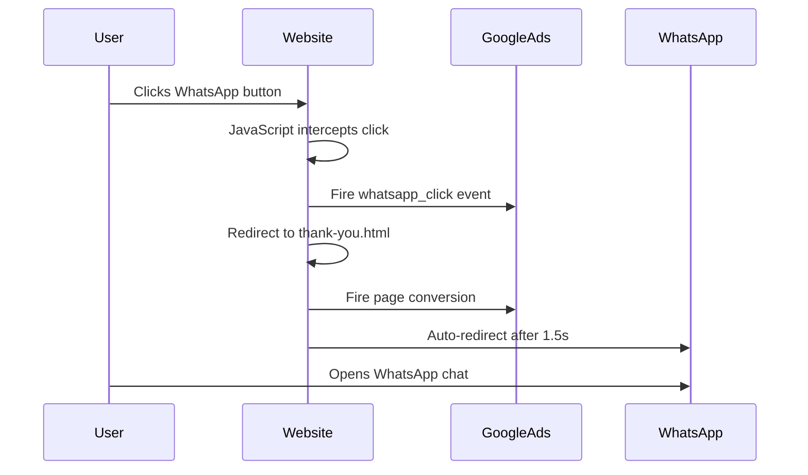

# Google Ads Conversion Tracking Implementation Plan

## Overview
This plan outlines the implementation of Google Ads conversion tracking for WhatsApp and Phone call buttons on the Antwave website. The goal is to track user interactions with these buttons as conversions in Google Ads to improve ad optimization.

## Current State Analysis

### Existing Setup
- **Google Ads Tag**: Already configured with ID `AW-17929209756`
- **TikTok Pixel**: Already implemented
- **WhatsApp Buttons Found**: 12 buttons total
  - 1 main CTA button in hero section
  - 1 contact info button in header
  - 10 product order buttons
- **Phone Buttons Found**: 2 buttons
  - 1 in header contact info
  - 1 in contact section

### Current Button Behavior
- WhatsApp buttons link directly to `https://wa.me/201125655647`
- Phone buttons link directly to `tel:01125655647`
- No conversion tracking is currently implemented

---

## Implementation Architecture



---

## Detailed Implementation Steps

### Step 1: Add Unique IDs to Buttons

#### WhatsApp Buttons
| Location | Current Code | New ID |
|----------|-------------|--------|
| Hero CTA | `<a href="https://wa.me/201125655647" class="btn btn-secondary">` | `id="wa-btn-hero"` |
| Header Contact | `<a href="https://wa.me/201125655647" class="contact-item">` | `id="wa-btn-header"` |
| White Shark Product | `<a href="https://wa.me/201125655647?text=..." class="order-btn">` | `id="wa-btn-white-shark"` |
| Huawei Quad Band | `<a href="https://wa.me/201125655647?text=..." class="order-btn">` | `id="wa-btn-huawei-quad"` |
| Golden Shark | `<a href="https://wa.me/201125655647?text=..." class="order-btn">` | `id="wa-btn-golden-shark"` |
| Quad Band Silver | `<a href="https://wa.me/201125655647?text=..." class="order-btn">` | `id="wa-btn-quad-silver"` |
| Wingstel Triband | `<a href="https://wa.me/201125655647?text=..." class="order-btn">` | `id="wa-btn-wingstel"` |
| Triple Display | `<a href="https://wa.me/201125655647?text=..." class="order-btn">` | `id="wa-btn-triple-display"` |
| Five Band | `<a href="https://wa.me/201125655647?text=..." class="order-btn">` | `id="wa-btn-five-band"` |
| Genuinetek Silver | `<a href="https://wa.me/201125655647?text=..." class="order-btn">` | `id="wa-btn-genuinetek-silver"` |
| Genuinetek Gold | `<a href="https://wa.me/201125655647?text=..." class="order-btn">` | `id="wa-btn-genuinetek-gold"` |
| Golden Classic | `<a href="https://wa.me/201125655647?text=..." class="order-btn">` | `id="wa-btn-golden-classic"` |
| Contact Section | `<a href="https://wa.me/201125655647">` | `id="wa-btn-contact"` |

#### Phone Buttons
| Location | Current Code | New ID |
|----------|-------------|--------|
| Header Contact | `<a href="tel:01125655647" class="contact-item">` | `id="phone-btn-header"` |
| Contact Section | `<a href="tel:01125655647">` | `id="phone-btn-contact"` |

---

### Step 2: Create Thank You Page

Create `thank-you.html` with the following features:
- Display a brief thank you message
- Fire Google Ads conversion event on page load
- Auto-redirect to the original destination after 1-2 seconds
- Accept URL parameters: `type` (whatsapp/phone), `dest` (destination URL), `product` (optional product name)

#### Thank You Page Structure
```
URL: thank-you.html?type=whatsapp&dest=https://wa.me/201125655647&product=White%20Shark
```

---

### Step 3: JavaScript Event Tracking Implementation

Add to [`script.js`](script.js):

```javascript
// Google Ads Conversion Tracking
function trackConversion(eventName, eventParams) {
    gtag('event', eventName, eventParams);
}

// WhatsApp Click Handler
function handleWhatsAppClick(event, buttonId, originalUrl, productName) {
    event.preventDefault();
    
    // Track the event
    trackConversion('whatsapp_click', {
        'send_to': 'AW-17929209756',
        'button_id': buttonId,
        'product_name': productName || 'general'
    });
    
    // Redirect to thank you page
    const thankYouUrl = `thank-you.html?type=whatsapp&dest=${encodeURIComponent(originalUrl)}&product=${encodeURIComponent(productName || '')}`;
    window.location.href = thankYouUrl;
}

// Phone Click Handler
function handlePhoneClick(event, buttonId) {
    event.preventDefault();
    
    // Track the event
    trackConversion('phone_click', {
        'send_to': 'AW-17929209756',
        'button_id': buttonId
    });
    
    // Redirect to thank you page
    const thankYouUrl = `thank-you.html?type=phone&dest=tel:01125655647`;
    window.location.href = thankYouUrl;
}
```

---

### Step 4: Google Ads Configuration

In Google Ads dashboard, create two conversion actions:

#### Conversion 1: WhatsApp Click
- **Name**: `whatsapp_click`
- **Category**: Lead
- **Conversion source**: Website
- **Event snippet**: Use the gtag event

#### Conversion 2: Phone Click
- **Name**: `phone_click`
- **Category**: Lead
- **Conversion source**: Website
- **Event snippet**: Use the gtag event

---

## File Changes Summary

### Files to Modify
1. **[`index.html`](index.html)** - Add IDs to all WhatsApp and Phone buttons
2. **[`script.js`](script.js)** - Add conversion tracking JavaScript code

### Files to Create
1. **`thank-you.html`** - Thank you/redirect page for conversion tracking

---

## Conversion Flow Diagram



---

## Benefits of This Implementation

1. **Accurate Tracking**: Google Ads will know exactly who clicked WhatsApp/Phone buttons
2. **Better Ad Optimization**: Google can optimize for users likely to convert
3. **Product-Level Tracking**: Know which products generate the most leads
4. **Button-Level Analytics**: Understand which button placements work best
5. **Seamless User Experience**: Brief thank you message before redirect

---

## Testing Checklist

- [ ] Verify all WhatsApp buttons have unique IDs
- [ ] Verify all Phone buttons have unique IDs
- [ ] Test thank-you page loads correctly
- [ ] Verify Google Ads events fire in browser console
- [ ] Confirm auto-redirect works for WhatsApp
- [ ] Confirm auto-redirect works for Phone
- [ ] Test on mobile devices
- [ ] Verify conversions appear in Google Ads dashboard
- [ ] Test with Google Tag Assistant extension

---

## Notes

- The thank-you page redirect delay should be 1-2 seconds to ensure the conversion event is properly recorded
- Consider adding a loading animation on the thank-you page for better UX
- The implementation preserves the original WhatsApp message text for product inquiries
